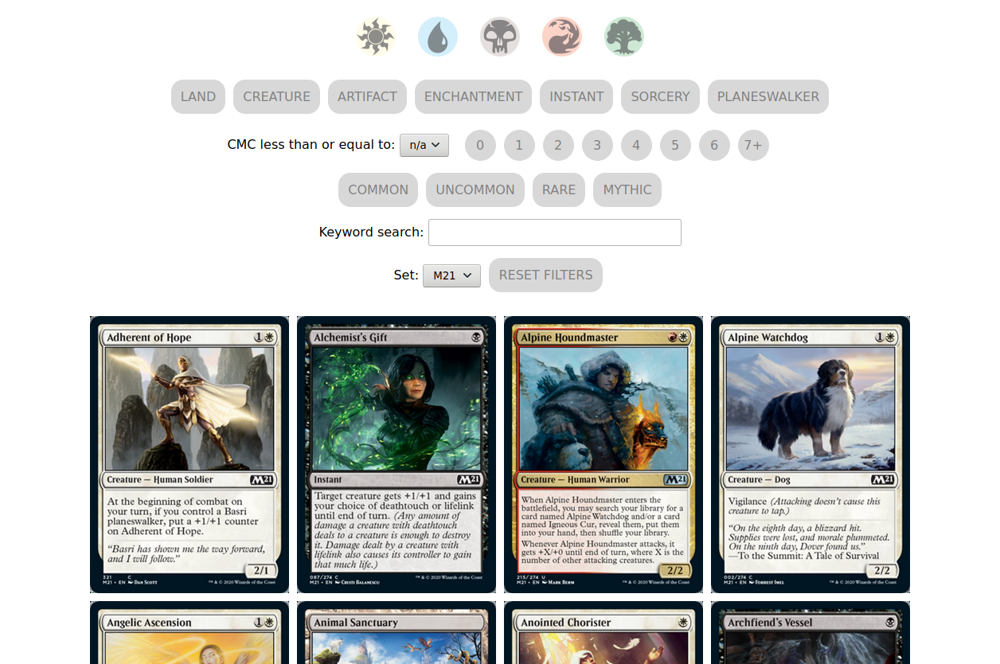
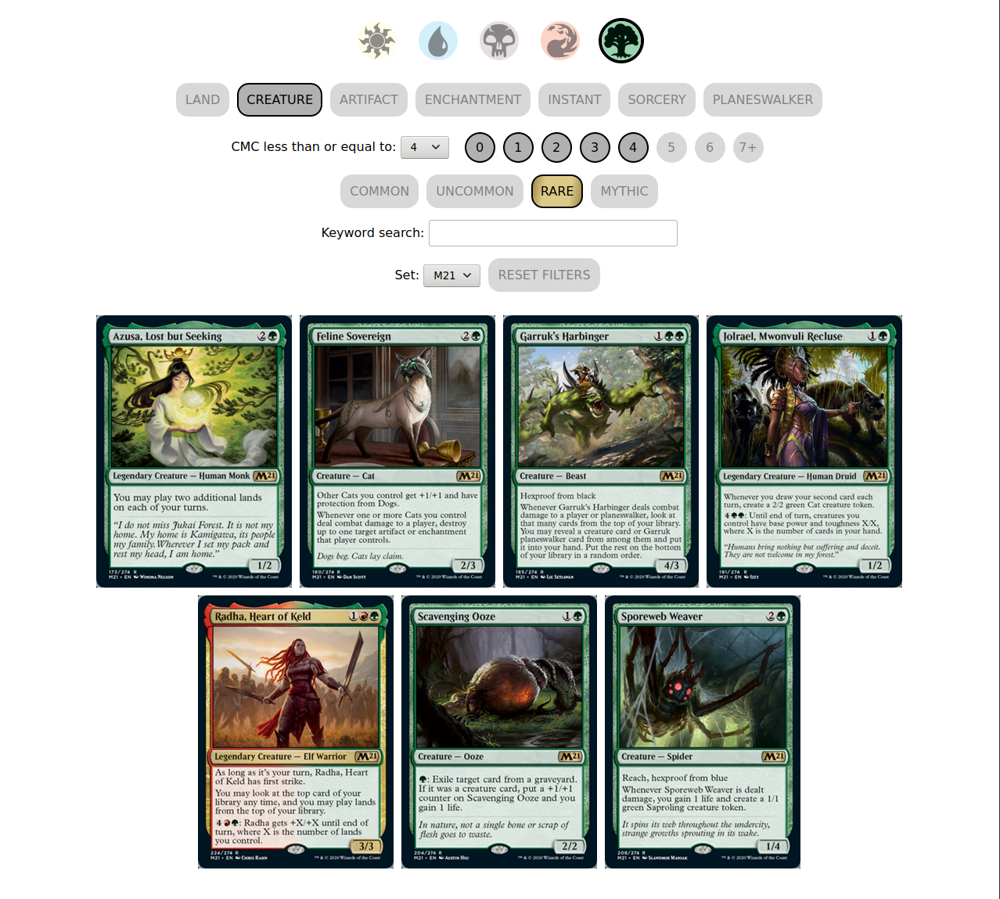
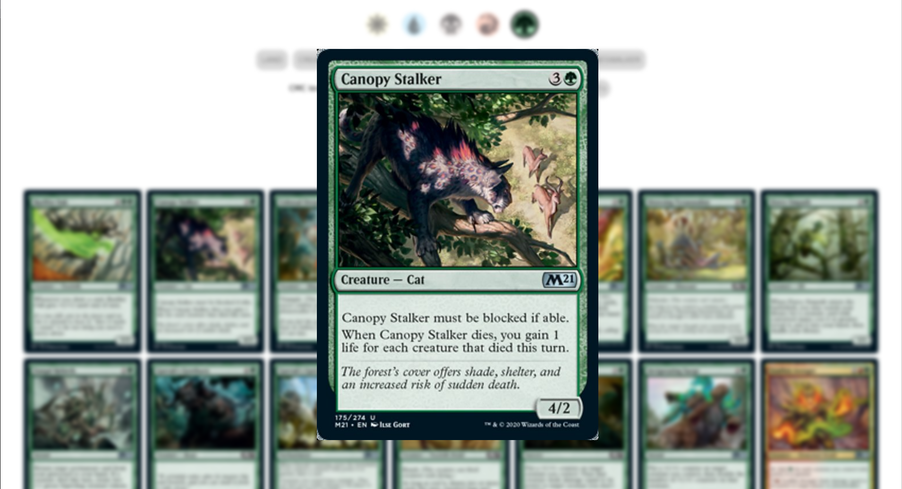

# Magic: The Gathering Card Viewer
This is a simple card display and search tool for Magic: The Gathering. It was built using Flask.

This is available on Heroku [here](https://mtg-card-viewer.herokuapp.com).

## Goal
I wanted to create a fast, easy-to-use card search tool for use during my draft games. My original idea was to be able to see what cards my opponent could play at any time. This is particularly useful when they are holding an instant spell; by picking the colors and maximum mana cost, I can have a better idea of what cards they may have.

I built this for use in drafts, so the card display is limited to one set at a time.

## Notes
This page uses Scryfall's REST API to pull the cards for each set.

The first version of this project used vanilla HTML, CSS, and JavaScript.

## Future Updates
I am planning on adding an interface for card evaulations, as well as functionality for grouping and sorting cards. 

## Screenshots

---

---

